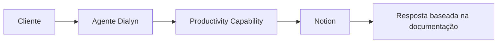
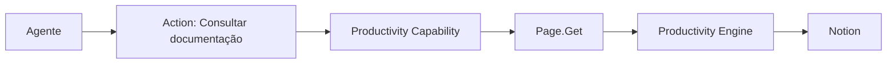

# Notion

> Integração de produtividade utilizada pela Dialyn para permitir que agentes de IA consultem, organizem e gerenciem informações armazenadas no Notion.

---

## Objetivo

O Notion é utilizado pela Dialyn para transformar bases de conhecimento, documentações e informações operacionais em fontes de contexto para agentes inteligentes.

> O agente consulta informações atualizadas diretamente no workspace da empresa — sem duplicar documentos ou manter bases separadas.

---

## Resumo

| Característica | Descrição |
|---------------|-----------|
| 🎯 **Foco** | Documentação e base de conhecimento |
| 📄 **Recursos** | Pages, Databases, Blocks |
| 🔁 **Sincronia** | Conteúdo sempre atualizado |
| 👥 **Público** | Empresas com wiki corporativa ou documentação |
| 🤖 **Integração** | Productivity Capability da Dialyn |

---

## Problemas que resolve

### Conhecimento espalhado

| Sem Dialyn | Com Dialyn |
|------------|-----------|
| Empresa mantém documentação no Notion | Cliente pergunta ao agente |
| Funcionário procura manualmente | Agente consulta Productivity Capability |
| Cliente aguarda resposta | Notion retorna a informação |
| Resposta lenta e inconsistente | Resposta baseada na documentação oficial |

> O agente utiliza o conhecimento já existente da empresa sem necessidade de replicá-lo.

### Base sempre atualizada

Quando uma página é alterada no Notion, os agentes passam a utilizar automaticamente a versão mais recente.

| Antes | Depois |
|-------|--------|
| Documentação duplicada | Fonte única e centralizada |
| Respostas desatualizadas | Informação sempre fresca |
| Múltiplas bases para manter | Manutenção zero |

---

## Casos de uso

### Consulta de documentação

Cliente: *"Como funciona o processo de onboarding?"*

O agente consulta a documentação correspondente antes de responder.

---

### Consulta de bases de dados

O agente pesquisa informações em Databases do Notion — produtos, procedimentos, FAQs, políticas internas e documentação técnica.

---

### Criação de páginas

O agente registra automaticamente:

- atas de reunião
- relatórios
- feedbacks
- registros de atendimento
- documentação gerada pelo agente

---

### Atualização de documentos

Durante a conversa, o agente altera status, adiciona observações, complementa documentação e atualiza procedimentos.

---

### Organização do workspace

O agente auxilia na estruturação: cria páginas, move conteúdos e organiza a documentação.

---

## Público recomendado

| Perfil | Exemplos |
|--------|----------|
| 📚 **Documentação técnica** | Manuais, guias, especificações |
| 🧠 **Base de conhecimento** | FAQs, políticas, procedimentos |
| 🏢 **Wiki corporativa** | Informações internas da empresa |
| 📋 **Gestão de projetos** | Organização de equipes e processos |

---

## Capacidades utilizadas

| Capability | Resources |
|-----------|-----------|
| **Productivity** | `Page` · `Database` · `Block` |

---

## Actions disponibilizadas

| Categoria | Ações |
|-----------|-------|
| Páginas | Criar, consultar, atualizar, listar |
| Databases | Consultar, pesquisar, criar registros, atualizar |
| Blocos | Criar, atualizar, listar, remover |

---

## Princípios

| # | Princípio | Descrição |
|---|-----------|-----------|
| 1 | 🔗 **Independência** | Agentes não dependem do Notion — ele é um Provider |
| 2 | 🔄 **Sincronia** | Conteúdo do Notion sempre refletido nas respostas |
| 3 | 🧩 **Centralização** | Fonte única de conhecimento para o agente |
| 4 | 📖 **Consistência** | Respostas padronizadas com base na documentação oficial |

---

## Benefícios

| # | Benefício |
|---|-----------|
| 1 | ⚡ **Respostas rápidas** baseadas na documentação da empresa |
| 2 | 🔄 **Conhecimento sempre atualizado** sem manutenção extra |
| 3 | 🤖 **Redução** de trabalho manual de documentação |
| 4 | 🎯 **Consistência** nas respostas do agente |
| 5 | 📉 **Menos retrabalho** com fonte única de informação |

---

## Quando não usar

Embora excelente para documentação, outros Providers da Capability **Productivity** são mais adequados para:

- gerenciamento detalhado de tarefas e sprints
- controle operacional de projetos
- calendários corporativos
- agendamento de reuniões

---

## Papel na arquitetura

O Notion não define as capacidades da plataforma — ele **implementa** a Capability **Productivity**.

> Ações como criar páginas, atualizar databases ou manipular blocos seguem o mesmo fluxo, mantendo os agentes desacoplados do Provider.

---

## Veja também

| Documento | Objetivo |
|-----------|----------|
| [README.md](./README.md) | Visão geral da integração |
| [Trello](../trello/provider.md) | Provider de gestão de tarefas |
| [Google Calendar](../google-calendar/provider.md) | Provider de calendário |
