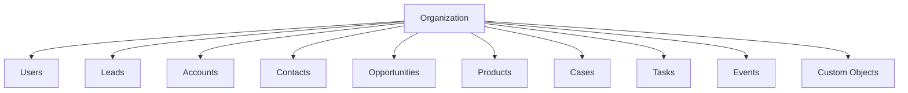
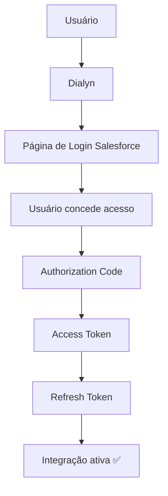
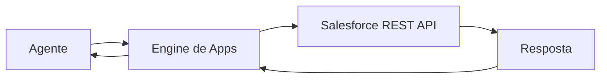

# Salesforce API

> Referências oficiais utilizadas para a integração do **Salesforce** na Dialyn.

---

## Objetivo

Este documento reúne os principais conceitos necessários para compreender como a Dialyn irá integrar-se ao **Salesforce**.

> **Nota:** Neste momento, o objetivo não é implementar funcionalidades, mas entender como a autenticação, permissões e arquitetura da API funcionam.

🔗 [Portal de Desenvolvedores Salesforce](https://developer.salesforce.com/docs)

---

## O que é o Salesforce?

O **Salesforce** é uma plataforma de CRM (Customer Relationship Management) utilizada para gerenciamento de clientes, oportunidades, vendas, suporte e automações.

Através da API é possível que aplicações externas realizem praticamente todas as operações disponíveis na plataforma.

| Operação | Descrição |
|----------|-----------|
| 👤 Criar Leads | Adicionar novos potenciais clientes |
| 🔍 Consultar Leads | Buscar dados de leads |
| ✏️ Atualizar Contatos | Editar informações de contatos |
| 🏢 Gerenciar Accounts | Administrar empresas e organizações |
| 💰 Criar Oportunidades | Registrar oportunidades de venda |
| 📦 Consultar Produtos | Listar produtos cadastrados |
| 📋 Registrar Atividades | Tarefas e eventos |
| 🆘 Criar Casos de Suporte | Chamados de atendimento |
| 🔎 Executar SOQL | Consultas personalizadas |

---

## Arquitetura do Salesforce

O Salesforce é organizado em **Objetos (Objects)**. Cada objeto representa uma entidade do CRM.

> Antes de implementar qualquer integração é importante compreender essa estrutura.

🔗 [Recursos da API REST](https://developer.salesforce.com/docs/atlas.en-us.api_rest.meta/api_rest/intro_understanding_resources.htm)

---

## Primeiro passo

Antes de qualquer integração o usuário deverá possuir:

| Requisito | Descrição |
|-----------|-----------|
| ✅ Conta Salesforce | Possuir uma conta ativa |
| 🏢 Organization ativa | Ambiente CRM configurado |
| 🔧 Permissão para utilizar APIs | Acesso habilitado para integrações |
| 🔗 Connected App criada | Aplicação registrada no Salesforce |

> Toda integração inicia pela criação de uma **Connected App**.

---

## O que é uma Connected App?

Uma **Connected App** representa uma aplicação autorizada a acessar dados do Salesforce. Ela será responsável por fornecer as credenciais utilizadas durante a autenticação OAuth.

🔗 [Entendendo Connected Apps](https://developer.salesforce.com/docs/atlas.en-us.api_rest.meta/api_rest/intro_understanding_connected_apps.htm)

---

## Credenciais

Após criar uma Connected App, o Salesforce disponibiliza:

| Credencial | Descrição |
|------------|-----------|
| `Consumer Key` | Client ID — identificador público da aplicação |
| `Consumer Secret` | Client Secret — chave privada da aplicação |

Essas credenciais identificam a aplicação durante o processo de autenticação.

---

## Método de Autenticação

O Salesforce utiliza **OAuth 2.0** como principal mecanismo de autenticação.

| Etapa | Descrição |
|-------|-----------|
| 1 | Usuário inicia fluxo pela **Dialyn** |
| 2 | Dialyn redireciona para **Login Salesforce** |
| 3 | Usuário **concede acesso** |
| 4 | Salesforce gera um **Authorization Code** |
| 5 | Código é trocado por um **Access Token** |
| 6 | **Refresh Token** é gerado para renovação |
| 7 | Integração é **ativada** |

🔗 [Endpoints OAuth](https://developer.salesforce.com/docs/atlas.en-us.api_rest.meta/api_rest/intro_understanding_oauth_endpoints.htm)

---

## Access Token

| Propriedade | Descrição |
|-------------|-----------|
| Uso | Autenticar todas as chamadas à API |
| Duração | Temporário (possui tempo de expiração) |
| Renovação | Utiliza o **Refresh Token** para obter um novo |

---

## Refresh Token

| Propriedade | Descrição |
|-------------|-----------|
| Uso | Renovar automaticamente o **Access Token** |
| Autorização | Depende do escopo concedido pelo usuário |
| Armazenamento | Deve ser armazenado **de forma segura** pela Dialyn |

---

## Instance URL

Além do `Access Token`, o Salesforce retorna uma **Instance URL**.

| Propriedade | Exemplo |
|-------------|---------|
| Instance URL | `https://mycompany.my.salesforce.com` |
| Uso | Base para todas as chamadas da API |

> ⚠️ Cada organização possui sua **própria Instance URL**. Todas as chamadas da API deverão utilizá-la como base.

---

## Permissões (Scopes)

Durante o OAuth o Salesforce solicita permissões.

| Escopo | Descrição |
|--------|-----------|
| 👁️ Acessar dados | Ler registros do CRM |
| ✏️ Atualizar dados | Modificar registros existentes |
| 🔄 Manter acesso offline | Renovar token sem novo login |
| 👤 Identificar usuário | Obter dados do usuário autenticado |

> A Dialyn deverá solicitar **apenas as permissões necessárias**.

🔗 [Scopes OAuth](https://help.salesforce.com/s/articleView?id=sf.remoteaccess_oauth_scopes.htm)

---

## Dados que a Dialyn deve armazenar

| Campo | Tipo | Descrição |
|-------|------|-----------|
| `Provider` | `string` | Identificador do provedor |
| `Organization ID` | `string` | ID da organização Salesforce |
| `Instance URL` | `string` | URL base da API |
| `Client ID` | `string` | Consumer Key |
| `Client Secret` | `string` | Consumer Secret |
| `Access Token` | `string` | Token de acesso |
| `Refresh Token` | `string` | Token para renovação |
| `Scopes` | `array` | Escopos de permissão concedidos |
| `Status` | `enum` | Status da integração |
| `Created At` | `datetime` | Data de criação |
| `Updated At` | `datetime` | Data de atualização |

---

## Recursos principais

| Recurso | Descrição |
|---------|-----------|
| 👤 Leads | Potenciais clientes |
| 🏢 Accounts | Empresas e organizações |
| 👥 Contacts | Pessoas vinculadas a Accounts |
| 💰 Opportunities | Oportunidades de venda |
| 📦 Products | Catálogo de produtos |
| 🆘 Cases | Chamados de suporte |
| 📋 Tasks | Tarefas relacionadas a registros |
| 📅 Events | Eventos de calendário |
| 👥 Users | Usuários do sistema |
| 📊 Reports | Relatórios do CRM |
| 📈 Dashboards | Painéis de indicadores |
| 🛠️ Custom Objects | Objetos personalizados |

🔗 [Lista de recursos da API](https://developer.salesforce.com/docs/atlas.en-us.api_rest.meta/api_rest/resources_list.htm)

---

## SOQL

O Salesforce utiliza uma linguagem própria chamada **SOQL** (Salesforce Object Query Language) para consultar informações dos objetos.

| Consulta | Descrição |
|----------|-----------|
| 👤 Consultar Leads | Buscar potenciais clientes |
| 👥 Consultar Contatos | Buscar contatos cadastrados |
| 💰 Consultar Oportunidades | Buscar oportunidades de venda |
| 📦 Consultar Produtos | Buscar catálogo de produtos |

🔗 [Documentação SOQL](https://developer.salesforce.com/docs/atlas.en-us.soql_sosl.meta/soql_sosl/)

---

## Fluxo Geral

> O agente **nunca** comunica-se diretamente com o Salesforce. Toda comunicação deverá ocorrer através do **Engine de Apps** da Dialyn.

---

## Regras de Negócio

| # | Regra |
|---|-------|
| 1 | ❌ **Nunca** expor o `Client Secret` |
| 2 | ❌ **Nunca** expor o `Refresh Token` |
| 3 | ❌ **Nunca** armazenar credenciais diretamente no código-fonte |
| 4 | 🔐 Utilizar **HTTPS** em todas as chamadas |
| 5 | 🔄 Renovar automaticamente o `Access Token` |
| 6 | 🎯 Solicitar apenas os **Scopes** necessários |
| 7 | 🚫 Permitir ao usuário **remover a integração** a qualquer momento |
| 8 | ⏱️ Respeitar os **limites de requisição** impostos pela API |

---

## Conceitos importantes

### Lead

Representa um **potencial cliente** que ainda não foi qualificado.

### Account

Representa uma **empresa ou organização** cadastrada no CRM.

### Contact

**Pessoa** pertencente a uma Account.

### Opportunity

Representa uma **oportunidade de venda** em andamento.

### Product

**Produto** cadastrado no catálogo do CRM.

### Task

**Tarefa** relacionada a um registro (ligação, reunião, e-mail).

### Event

**Evento de calendário** vinculado a um registro.

### Case

**Chamado ou solicitação de suporte** aberto por um cliente.

### Custom Object

**Objeto personalizado** criado pelo cliente dentro do Salesforce para atender necessidades específicas.

---

## API Reference

🔗 [Documentação completa das APIs](https://developer.salesforce.com/docs/apis)

---

## Webhooks

O Salesforce oferece mecanismos para notificação de alterações:

| Recurso | Descrição |
|---------|-----------|
| 📢 Platform Events | Eventos customizados da plataforma |
| 🔄 Change Data Capture | Captura de alterações em registros |
| 📡 Streaming API | Notificações em tempo real |

> Esses recursos permitem que a Dialyn seja notificada quando determinados registros forem criados, alterados ou removidos, **reduzindo a necessidade de consultas constantes**.

🔗 [Pub/Sub API](https://developer.salesforce.com/docs/platform/pub-sub-api)

---

## Limites da API

O Salesforce aplica limites de utilização (**API Limits**) conforme o tipo de licença e edição da organização.

| Requisito | Descrição |
|-----------|-----------|
| ⏱️ Limite diário | Número máximo de requisições por dia |
| 📊 Monitoramento | Acompanhar consumo para evitar bloqueios |

> A Dialyn deverá monitorar esses limites para evitar bloqueios temporários.

🔗 [Headers de uso da API](https://developer.salesforce.com/docs/atlas.en-us.api_rest.meta/api_rest/headers_api_usage.htm)

---

## Boas práticas

| # | Prática |
|---|---------|
| 1 | 🔐 Utilizar **OAuth 2.0** |
| 2 | ❌ **Nunca** expor `Client Secret` |
| 3 | ❌ **Nunca** expor `Refresh Token` |
| 4 | 🔒 Armazenar credenciais de forma segura |
| 5 | 🔄 Renovar automaticamente o `Access Token` |
| 6 | 🎯 Solicitar apenas os **Scopes** necessários |
| 7 | 🔔 Utilizar **Webhooks** sempre que possível |
| 8 | 🏗️ Centralizar toda comunicação através do **Engine de Apps** da Dialyn |

---

## Próximo Documento

Após compreender esta documentação, iniciar:

📄 [`/docs/apps/architeture/dtos/crm/README.md`](/docs/apps/architeture/dtos/crm/README.md)

---

### Conteúdo previsto

| Ação | Descrição |
|------|-----------|
| 👤 Criar Lead | Adicionar novo lead |
| ✏️ Atualizar Lead | Editar lead existente |
| 🔍 Consultar Lead | Buscar dados de lead |
| 👥 Criar Contact | Adicionar novo contato |
| ✏️ Atualizar Contact | Editar contato existente |
| 🏢 Criar Account | Adicionar nova empresa |
| 💰 Criar Opportunity | Registrar oportunidade |
| ✏️ Atualizar Opportunity | Editar oportunidade |
| 📋 Criar Task | Adicionar tarefa |
| 📅 Criar Event | Adicionar evento |
| 🔎 Buscar registros com SOQL | Consultas personalizadas |
| 🔔 Receber notificações | Alterações em tempo real |
| 📊 Consultar relatórios | Acessar relatórios do CRM |
