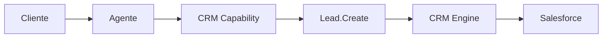
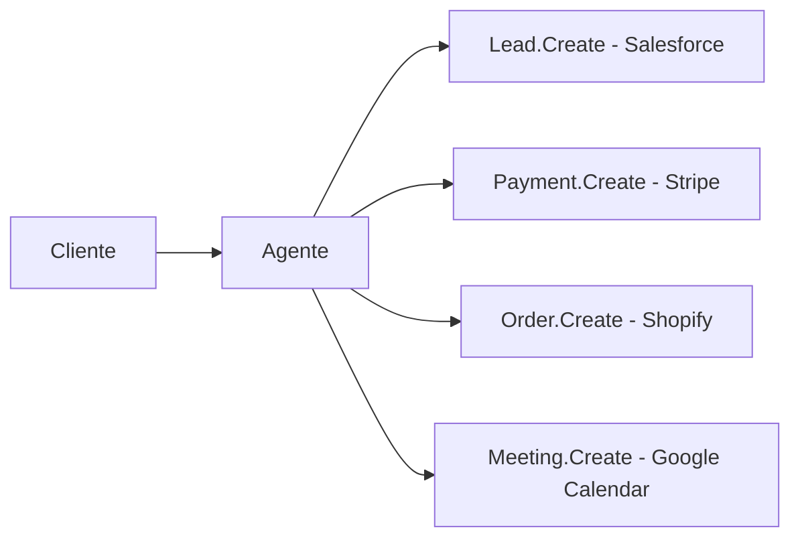

# Salesforce

> Integração de CRM utilizada pela Dialyn para permitir que agentes de IA gerenciem relacionamentos comerciais, oportunidades de vendas e informações de clientes ao longo de todo o ciclo de vida.

---

## Objetivo

O Salesforce é utilizado pela Dialyn para integrar agentes inteligentes ao principal sistema comercial da empresa.

Enquanto um sistema de pagamentos controla transações e uma plataforma de e-commerce controla pedidos, o Salesforce controla o **relacionamento entre a empresa e seus clientes**.

> O agente não apenas conversa com clientes — ele participa ativamente dos processos comerciais, registrando informações, acompanhando negociações e automatizando tarefas de vendas.

---

## Resumo

| Característica | Descrição |
|---------------|-----------|
| 🎯 **Foco** | Gestão do relacionamento comercial |
| 🗂️ **Recursos** | Leads, Deals, Companies, Contacts |
| 🔁 **Automação** | Funil de vendas, cadastro, atualização |
| 👥 **Público** | Empresas B2B, SaaS, vendas estruturadas |
| 🤖 **Integração** | CRM Capability da Dialyn |

---

## O que é um CRM?

CRM significa **Customer Relationship Management**. É o sistema responsável por organizar todo o histórico comercial da empresa.

| Um CRM registra | Exemplo |
|----------------|---------|
| 📞 **Contato** | Quando o cliente entrou em contato |
| 🎯 **Interesse** | Quais produtos demonstrou interesse |
| 💼 **Negociações** | Quais oportunidades estão abertas |
| 👤 **Responsável** | Quem é o vendedor |
| ✅ **Vendas** | Quais vendas já foram concluídas |

> Na prática, o CRM é a memória comercial da empresa.

---

## Problemas que resolve

### Informações espalhadas

| Sem CRM | Com Salesforce + Dialyn |
|---------|------------------------|
| WhatsApp, e-mail, planilhas, anotações | Tudo centralizado no CRM |
| Equipe tenta lembrar do cliente | Agente consulta histórico completo |
| Informação perdida entre canais | Dados sempre disponíveis na conversa |

### Oportunidades perdidas

| Sem integração | Com Dialyn |
|---------------|-----------|
| Cliente demonstra interesse | Cliente demonstra interesse |
| Conversa termina | Agente cria Lead |
| Equipe esquece o cliente | Lead entra no funil de vendas |
| Oportunidade perdida | Venda acompanhada até o fechamento |

> Nenhuma oportunidade fica esquecida.

---

## Casos de uso

### Cadastro automático de Leads

Quando um novo potencial cliente entra em contato, o agente cria o Lead automaticamente.

---

### Consulta do histórico

Antes de responder, o agente verifica: compras anteriores, negociações, chamados, observações e oportunidades abertas — tornando o atendimento personalizado.

---

### Atualização do funil

Cliente aceita proposta → agente atualiza o Deal → pipeline reflete o novo estágio.

---

### Cadastro de empresas (B2B)

O agente registra razão social, segmento, porte, localização e responsável comercial.

---

### Gestão de contatos

Criar, atualizar e consultar contatos, além de localizar responsáveis e histórico de comunicação.

---

### Automação comercial

| Evento | Ação do agente |
|--------|---------------|
| Formulário preenchido | Criar Lead |
| Pagamento aprovado | Atualizar oportunidade |
| Reunião concluída | Mover negociação |
| Nova demanda | Criar tarefa para vendedor |

---

## Público recomendado

| Perfil | Exemplos |
|--------|----------|
| 💼 **Equipes de vendas** | Processo comercial estruturado |
| 🏢 **B2B** | Empresas que vendem para empresas |
| 📊 **SaaS** | Ciclo de vendas complexo |
| 🏠 **Imobiliárias** | Acompanhamento de leads |
| 🏭 **Indústrias** | Grande volume de clientes |

---

## Capacidades utilizadas

| Capability | Resources |
|-----------|-----------|
| **CRM** | `Lead` · `Deal` · `Company` · `Contact` |

---

## Actions disponibilizadas

| Categoria | Ações |
|-----------|-------|
| Leads | Criar, consultar, atualizar, pesquisar |
| Deals | Criar, consultar, atualizar, alterar estágio |
| Companies | Criar, consultar, atualizar |
| Contacts | Criar, consultar, atualizar, pesquisar |

---

## Princípios

| # | Princípio | Descrição |
|---|-----------|-----------|
| 1 | 🔗 **Independência** | Agentes não dependem do Salesforce — ele é um Provider |
| 2 | 🧠 **Memória comercial** | Todo histórico do cliente centralizado |
| 3 | 🔄 **Automação** | Leads, deals e contatos sem digitação manual |
| 4 | 🎯 **Visibilidade** | Funil de vendas sempre atualizado |

---

## Benefícios

| # | Benefício |
|---|-----------|
| 1 | 🧠 **Histório completo** do cliente antes de cada resposta |
| 2 | ⚡ **Lead criado** automaticamente no funil |
| 3 | 🔄 **Oportunidades** atualizadas em tempo real |
| 4 | 🤖 **Redução** do trabalho operacional dos vendedores |
| 5 | 📈 **Mais vendas** com acompanhamento sistemático |

---

## Quando não usar

Embora seja um dos CRMs mais completos, alguns cenários não exigem um CRM corporativo:

- pequenos negócios sem processo comercial estruturado
- empresas que apenas precisam controlar pedidos
- operações focadas exclusivamente em pagamentos

> Nesses casos, outras integrações da Dialyn podem atender melhor.

---

## Papel na arquitetura

O Salesforce não define as capacidades da plataforma — ele **implementa** a Capability **CRM**.

> Operações como atualizar Deals, consultar Contacts ou registrar Companies seguem o mesmo fluxo.

---

## Integração entre Capabilities

Um dos maiores benefícios da arquitetura Dialyn é permitir que diferentes Capabilities trabalhem juntas.

Nesse cenário, o Salesforce acompanha toda a jornada comercial enquanto as demais Capabilities executam suas responsabilidades específicas.

> O CRM torna-se o ponto central do relacionamento com o cliente, mantendo todo o histórico sincronizado com os demais sistemas.

---

## Veja também

| Documento | Objetivo |
|-----------|----------|
| [README.md](./README.md) | Visão geral da integração |
| [Typeform](../type-form/provider.md) | Provider de formulários |
| [Shopify](../shopify/provider.md) | Provider de e-commerce |
