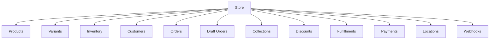
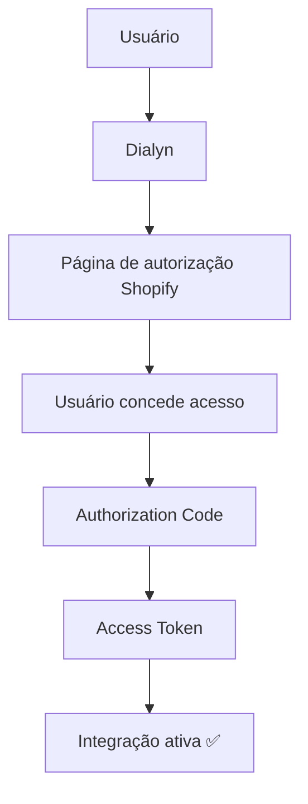
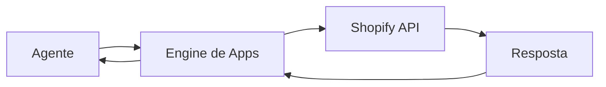

# Shopify API

> Referências oficiais utilizadas para a integração da **Shopify** na Dialyn.

---

## Objetivo

Este documento reúne os principais conceitos necessários para compreender como a Dialyn irá integrar-se à **Shopify**.

> **Nota:** Neste momento, o objetivo não é implementar funcionalidades, mas entender como a autenticação, permissões e arquitetura da API funcionam.

🔗 [Portal de Desenvolvedores Shopify](https://shopify.dev/)

---

## O que é a Shopify?

A **Shopify** é uma plataforma de e-commerce utilizada para criação e gerenciamento de lojas virtuais.

Através da API é possível que aplicações externas consultem e gerenciem praticamente todos os recursos de uma loja.

| Operação | Descrição |
|----------|-----------|
| 🔍 Consultar pedidos | Obter dados de transações |
| ➕ Criar pedidos | Registrar novos pedidos |
| 👥 Consultar clientes | Buscar dados de clientes |
| 👤 Criar clientes | Cadastrar novos clientes |
| 📦 Consultar produtos | Listar catálogo de produtos |
| 📊 Atualizar estoque | Gerenciar inventário |
| 🗂️ Consultar coleções | Agrupamentos de produtos |
| 🏷️ Gerenciar descontos | Criar e editar promoções |
| 💳 Consultar transações | Histórico de pagamentos |
| 🔔 Receber eventos | Notificações em tempo real |

---

## Arquitetura da Shopify

A estrutura da Shopify é organizada em recursos pertencentes a uma **Loja**.

> Antes de implementar qualquer integração é recomendado compreender essa organização.

🔗 [Documentação da API](https://shopify.dev/docs/api)

---

## Primeiro passo

Antes de qualquer integração o usuário deverá possuir:

| Requisito | Descrição |
|-----------|-----------|
| ✅ Conta Shopify | Possuir uma conta ativa |
| 🏪 Loja ativa | Loja configurada e publicada |
| 🔧 Permissão para instalar aplicativos | Acesso administrativo |
| 📝 Aplicação criada | No Shopify Partner Dashboard ou Custom App |

> Toda integração inicia pela criação de uma **aplicação**.

🔗 [Construir Apps Shopify](https://shopify.dev/docs/apps/build)

---

## O que é uma App?

Uma **App** representa uma aplicação autorizada a acessar recursos de uma loja Shopify.

| Componente | Descrição |
|------------|-----------|
| ✅ Permissões | Scopes de acesso concedidos |
| 🔐 Credenciais | API Key, API Secret |
| 🔑 Autenticação | OAuth 2.0 ou token de Custom App |
| 🔔 Webhooks | Eventos em tempo real |
| 📡 APIs disponíveis | GraphQL e REST |

> No contexto da Dialyn, cada integração corresponde a uma **App autorizada** pelo proprietário da loja.

---

## Credenciais

Após criar uma aplicação serão disponibilizadas:

| Credencial | Descrição |
|------------|-----------|
| `Client ID` (API Key) | Identificador público da aplicação |
| `Client Secret` (API Secret) | Chave privada da aplicação |
| `Access Token` | Token obtido após autorização da loja |

🔗 [Autenticação e Autorização](https://shopify.dev/docs/apps/build/authentication-authorization)

---

## Método de Autenticação

A Shopify utiliza **OAuth 2.0** para aplicações públicas e um fluxo específico para **Custom Apps**.

| Etapa | Descrição |
|-------|-----------|
| 1 | Usuário inicia fluxo pela **Dialyn** |
| 2 | Dialyn redireciona para **autorização Shopify** |
| 3 | Usuário **concede acesso** |
| 4 | Shopify gera um **Authorization Code** |
| 5 | Código é trocado por um **Access Token** |
| 6 | Integração é **ativada** |

🔗 [Access Tokens](https://shopify.dev/docs/apps/build/authentication-authorization/access-tokens)

---

## Access Token

| Propriedade | Descrição |
|-------------|-----------|
| Uso | Autenticar todas as chamadas à API |
| Identifica | A loja autorizada |
| Armazenamento | Deve ser armazenado **de forma segura** |

---

## Scopes (Permissões)

A Shopify trabalha com **Scopes**. Cada Scope representa uma permissão concedida pela loja.

| Scope | Descrição |
|-------|-----------|
| `read_products` | Consultar produtos |
| `write_products` | Criar e editar produtos |
| `read_orders` | Consultar pedidos |
| `write_orders` | Criar e editar pedidos |
| `read_customers` | Consultar clientes |
| `write_customers` | Criar e editar clientes |
| `read_inventory` | Consultar estoque |
| `write_inventory` | Atualizar estoque |
| `read_discounts` | Consultar descontos |
| `write_discounts` | Criar e editar descontos |

> A Dialyn deverá solicitar **apenas os Scopes necessários**.

🔗 [Access Scopes](https://shopify.dev/docs/api/usage/access-scopes)

---

## Dados que a Dialyn deve armazenar

| Campo | Tipo | Descrição |
|-------|------|-----------|
| `Provider` | `string` | Identificador do provedor |
| `Store ID` | `string` | ID da loja Shopify |
| `Store Domain` | `string` | Domínio da loja |
| `Client ID` | `string` | API Key |
| `Client Secret` | `string` | API Secret |
| `Access Token` | `string` | Token de acesso |
| `Scopes` | `array` | Permissões concedidas |
| `Status` | `enum` | Status da integração |
| `Created At` | `datetime` | Data de criação |
| `Updated At` | `datetime` | Data de atualização |

---

## Recursos principais

| Recurso | Descrição |
|---------|-----------|
| 📦 Products | Catálogo de produtos |
| 🎨 Variants | Variações de produtos (cor, tamanho) |
| 📊 Inventory | Controle de estoque |
| 👥 Customers | Clientes da loja |
| 🛒 Orders | Pedidos realizados |
| 📝 Draft Orders | Pedidos manuais pré-confirmação |
| 🗂️ Collections | Agrupamentos de produtos |
| 🏷️ Discounts | Descontos e promoções |
| 📍 Locations | Endereços e depósitos |
| 📦 Fulfillments | Processo de envio |
| 💳 Transactions | Transações financeiras |
| 🏷️ Metafields | Campos personalizados |
| 🔔 Webhooks | Eventos em tempo real |

🔗 [Admin API](https://shopify.dev/docs/api/admin)

---

## GraphQL Admin API

A Shopify **recomenda** a utilização da **GraphQL Admin API** como principal interface para novas integrações. Embora ainda exista suporte para algumas operações REST, novos desenvolvimentos devem priorizar **GraphQL**.

🔗 [GraphQL Admin API](https://shopify.dev/docs/api/admin-graphql)

---

## Fluxo Geral

> O agente **nunca** comunica-se diretamente com a Shopify. Toda comunicação deverá ocorrer através do **Engine de Apps** da Dialyn.

---

## Regras de Negócio

| # | Regra |
|---|-------|
| 1 | ❌ **Nunca** expor `Client Secret` |
| 2 | ❌ **Nunca** expor `Access Token` |
| 3 | 🔒 Armazenar credenciais de forma segura |
| 4 | 🔐 Utilizar **HTTPS** em todas as chamadas |
| 5 | 🎯 Solicitar apenas os **Scopes** necessários |
| 6 | ✅ Validar se a loja permanece autorizada |
| 7 | ⏱️ Implementar tratamento para **limites de utilização** |
| 8 | 🚫 Permitir que o usuário **desconecte a loja** a qualquer momento |

---

## Conceitos importantes

### Store

Representa uma **loja Shopify** com todos os seus recursos.

### Product

**Produto** comercializado na loja.

### Variant

Cada **combinação possível** de um produto (ex.: cor, tamanho, modelo).

### Inventory

**Controle de estoque** dos produtos e variantes.

### Customer

**Cliente** da loja com histórico de pedidos.

### Order

**Pedido** realizado por um cliente.

### Draft Order

Pedido criado **manualmente** pela aplicação antes da confirmação do cliente.

### Fulfillment

Processo responsável pelo **envio do pedido** ao cliente.

### Collection

**Agrupamento** de produtos para organização da loja.

### Metafields

**Campos personalizados** adicionados aos recursos da Shopify para atender necessidades específicas.

---

## API Reference

🔗 [Documentação completa da Admin API](https://shopify.dev/docs/api/admin)

---

## Webhooks

A Shopify suporta **Webhooks** para comunicação em tempo real.

| Evento | Descrição |
|--------|-----------|
| 🛒 Pedido criado | Novo pedido registrado |
| ✏️ Pedido atualizado | Alteração em pedido existente |
| ❌ Pedido cancelado | Pedido cancelado |
| 👤 Cliente criado | Novo cliente cadastrado |
| ✏️ Cliente atualizado | Dados de cliente alterados |
| 📦 Produto criado | Novo produto adicionado |
| ✏️ Produto atualizado | Produto modificado |
| 📊 Estoque alterado | Nível de estoque modificado |

🔗 [Webhooks Shopify](https://shopify.dev/docs/apps/build/webhooks)

---

## Limites da API

A Shopify aplica limites de utilização para proteger sua infraestrutura.

| API | Mecanismo |
|-----|-----------|
| 🧩 **GraphQL Admin API** | Baseado em custo ("query cost") |
| 🔄 **APIs legadas** | Rate limiting tradicional |

> A Dialyn deverá monitorar esses limites e implementar controle de repetição quando necessário.

🔗 [Rate Limits](https://shopify.dev/docs/api/usage/rate-limits)

---

## Boas práticas

| # | Prática |
|---|---------|
| 1 | 🔐 Utilizar **OAuth 2.0** para aplicações públicas |
| 2 | 🔐 Utilizar **HTTPS** em todas as chamadas |
| 3 | ❌ **Nunca** expor `Client Secret` |
| 4 | ❌ **Nunca** expor `Access Token` |
| 5 | 🎯 Solicitar apenas os **Scopes** necessários |
| 6 | 🧩 Utilizar **GraphQL Admin API** para novos desenvolvimentos |
| 7 | 🔔 Utilizar **Webhooks** sempre que possível |
| 8 | 🏗️ Centralizar toda comunicação através do **Engine de Apps** da Dialyn |

---

## Próximo Documento

Após compreender esta documentação, iniciar:

📄 [`/docs/apps/architeture/dtos/productivity/README.md`](/docs/apps/architeture/dtos/productivity/README.md)

---

### Conteúdo previsto

| Ação | Descrição |
|------|-----------|
| 📦 Consultar Produtos | Listar catálogo de produtos |
| ➕ Criar Produto | Adicionar novo produto |
| ✏️ Atualizar Produto | Editar produto existente |
| 🛒 Consultar Pedidos | Listar pedidos realizados |
| 📝 Criar Draft Order | Pedido manual pré-confirmação |
| 👥 Consultar Clientes | Buscar dados de clientes |
| 👤 Criar Cliente | Cadastrar novo cliente |
| 📊 Atualizar Estoque | Gerenciar inventário |
| 🗂️ Consultar Coleções | Listar agrupamentos |
| 🏷️ Gerenciar Descontos | Criar e editar promoções |
| 💳 Consultar Transações | Histórico de pagamentos |
| 🔔 Receber Webhooks | Notificações em tempo real |
| 🏷️ Gerenciar Metafields | Campos personalizados |
