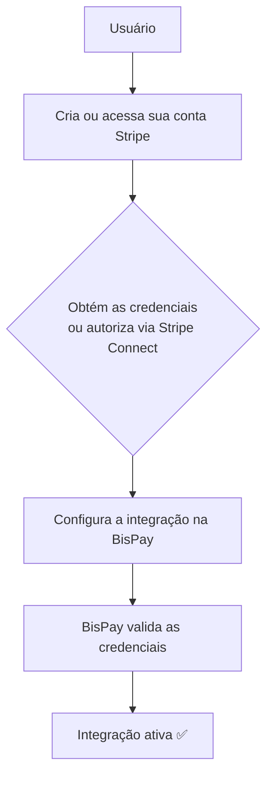

# Stripe

## Autenticação

### Objetivo

Esta documentação descreve os requisitos mínimos para que a **BisPay** consiga estabelecer comunicação com a API da **Stripe**.

> **Nota:** Neste momento, o objetivo não é processar pagamentos, mas apenas preparar a autenticação da integração.

---

## Como funciona a Stripe?

A Stripe disponibiliza uma **API REST** para que aplicações externas possam criar pagamentos, assinaturas, clientes, reembolsos, cobranças e diversos outros recursos.

Toda comunicação com a API é autenticada através de **credenciais** emitidas pela própria Stripe.

🔗 [Documentação oficial da Stripe](https://docs.stripe.com/?locale=pt-BR)

---

## Primeiro passo

Antes de qualquer integração, o usuário deverá possuir:

| Requisito | Descrição |
|-----------|-----------|
| ✅ Conta Stripe | Possuir uma conta ativa |
| ✅ Conta verificada | Conta com dados verificados |
| ✅ Acesso ao Dashboard Stripe | Habilitar acesso ao painel de controle |
| ✅ Permissões para visualizar credenciais de API | Acesso às chaves de API |

> Toda integração nasce a partir dessa conta.

---

## O que representa uma conta Stripe?

Uma **conta Stripe** representa a identidade financeira de uma empresa ou pessoa dentro da plataforma.

| Responsabilidade | Descrição |
|------------------|-----------|
| 💰 Receber pagamentos | Processar transações financeiras |
| 📄 Emitir cobranças | Gerar faturas e boletos |
| 🔄 Criar assinaturas | Gerenciar pagamentos recorrentes |
| ↩️ Realizar reembolsos | Estornar transações |
| 👥 Administrar clientes | Gerenciar base de clientes |
| 📊 Controlar saldo e repasses | Acompanhar fluxo financeiro |

> A **BisPay** apenas utilizará essa conta para executar operações autorizadas pelo usuário.

---

## Credenciais

A Stripe trabalha com **dois ambientes independentes**.

### 🧪 Ambiente de Testes

Utilizado durante o desenvolvimento. Todos os pagamentos são **simulados** e nenhuma movimentação financeira ocorre.

🔗 [Como encontrar chaves de API](https://support.stripe.com/questions/what-are-stripe-api-keys-and-how-to-find-them?locale=pt-BR)

### 🚀 Ambiente de Produção

Utilizado para pagamentos **reais**. As credenciais deste ambiente movimentam dinheiro e devem ser protegidas com extremo cuidado.

🔗 [Como encontrar chaves de API](https://support.stripe.com/questions/what-are-stripe-api-keys-and-how-to-find-them?locale=pt-BR)

---

## Informações fornecidas

Dependendo do modelo de integração, a Stripe disponibiliza:

| Informação | Obrigatório | Utilização |
|------------|-------------|------------|
| `Publishable Key` | Sim | Frontend (operações permitidas ao cliente) |
| `Secret Key` | Sim | Backend. Autoriza chamadas protegidas da API. |
| `Restricted Key` | Opcional | Chaves com permissões limitadas para maior segurança |
| `Client ID` | Connect/OAuth | Identifica a aplicação durante o processo de autorização |

> ⚠️ **Recomendação da Stripe:** `Secret Keys` e `Restricted Keys` devem permanecer **exclusivamente no backend**.

---

## Qual credencial a BisPay utilizará?

Existem **dois modelos** possíveis.

### Modelo 1: Secret API Key

O usuário informa sua **chave secreta** da Stripe.

| Característica | Detalhe |
|----------------|---------|
| Indicado para | Integrações iniciais e simples |
| Operação | BisPay executa operações diretamente em nome da conta |
| Vantagens | Implementação simples, poucas etapas, configuração rápida |

### Modelo 2: Stripe Connect (OAuth)

Neste modelo o usuário **autoriza a BisPay** através do fluxo oficial da Stripe Connect.

| Característica | Detalhe |
|----------------|---------|
| Funcionamento | BisPay recebe um token de acesso para operar em nome da conta conectada |
| Segurança | Usuário **não** precisa informar sua chave secreta diretamente |
| Indicado para | Plataformas SaaS que conectam contas de terceiros |

🔗 [Documentação Stripe Connect](https://docs.stripe.com/connect/testing)

---

## Fluxos de autenticação

A Stripe suporta diferentes formas de autenticação conforme o tipo de integração.

| Fluxo | Descrição | Quando usar |
|-------|-----------|-------------|
| **API Key** | Autentica chamadas utilizando uma `Secret Key` ou `Restricted Key` no header `Authorization: Bearer` | Integrações diretas com a conta Stripe |
| **Stripe Connect** | Plataforma conecta contas Stripe de seus usuários via OAuth | Plataformas SaaS, marketplaces, multi-vendedor |

🔗 [Testando Stripe Connect](https://docs.stripe.com/connect/testing)

---

## Dados que a BisPay deve armazenar

Para cada integração recomenda-se armazenar:

| Campo | Tipo | Descrição |
|-------|------|-----------|
| `Provider` | `string` | Identificador do provedor |
| `Environment` | `enum` | Sandbox \| Production |
| `Publishable Key` | `string` | Chave pública para frontend |
| `Secret Key` | `string` | Chave secreta da API |
| `Restricted Key` | `string` | Chave com permissões limitadas |
| `Client ID` | `string` | Identificador da aplicação |
| `Account ID` | `string` | ID da conta Stripe conectada |
| `Status` | `enum` | Status da integração |
| `Scopes` | `array` | Escopos de permissão concedidos |
| `Expires At` | `datetime` | Data de expiração do token |
| `Created At` | `datetime` | Data de criação |
| `Updated At` | `datetime` | Data de atualização |

> Nem todos os campos serão utilizados em todas as integrações. O modelo deve permitir suportar tanto autenticação por **API Key** quanto integrações futuras utilizando **Stripe Connect**.

---

## Regras de Negócio

A BisPay deverá seguir algumas regras fundamentais:

| # | Regra |
|---|-------|
| 1 | ❌ **Nunca** expor a `Secret Key` ao frontend |
| 2 | ❌ **Nunca** armazenar credenciais em texto simples |
| 3 | 🔒 Separar completamente ambientes de **Teste** e **Produção** |
| 4 | ✅ Validar se a integração permanece ativa antes de qualquer operação |
| 5 | 🛡️ Utilizar `Restricted Keys` sempre que possível para reduzir permissões |
| 6 | 🔄 Permitir a **rotação de credenciais** sem interromper a operação da plataforma |

---

## Fluxo de Autenticação

| Etapa | Descrição |
|-------|-----------|
| 1 | Usuário cria ou acessa sua **conta Stripe** |
| 2 | Obtém as **credenciais** ou **autoriza via Stripe Connect** |
| 3 | **Configura a integração** na BisPay |
| 4 | BisPay **valida as credenciais** com a Stripe |
| 5 | Integração é **ativada** e pronta para uso |

---

## Próximo Documento

Após compreender esta documentação, iniciar:

📄 [`/docs/apps/architeture/dtos/payments/README.md`](/docs/apps/architeture/dtos/payments/README.md)

---

### Conteúdo previsto

| Ação | Descrição |
|------|-----------|
| ⚡ Criar pagamento | Criar pagamento |
| 💰 Criar Link de Pagamento | Criação de link de pagamento |
| 👥 Criar Checkout | Criação de checkout |
| 💰 Criar Assinaturas | Assinaturas recorrentes |
| 🤝 Consultar Assinaturas | Acompanhar status de assinaturas |
| 💵 Consultar Comissões | Valores de comissões |
| 🎟️ Buscar Eventos | Informações de eventos |
| 🔔 Receber Webhooks | Notificações em tempo real |
| 📋 Consultar Histórico de Assinaturas | Histórico completo |
| ❓Cancelar Assinaturas | Acompanhar status de assinaturas |
| 🔄 Reembolsar pagamentos | Reembolsar pagamentos |
| 📋 Consultar pagamentos | Consultar pagamentos |
| 📦 Gerenciar produtos e preços | Gerenciar produtos e preços |
