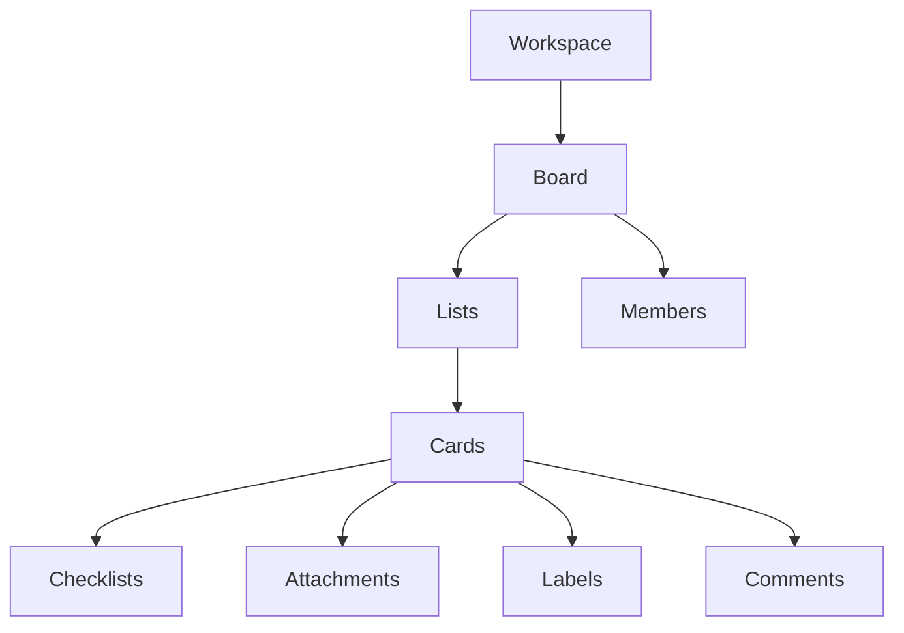
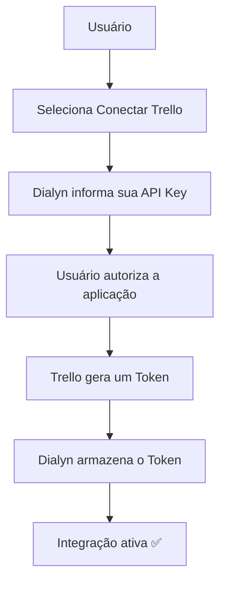
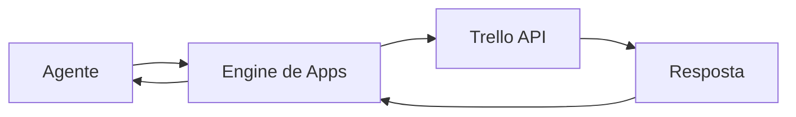

# Trello API

> Referências oficiais utilizadas para a integração do **Trello** na Dialyn.

---

## Objetivo

Este documento reúne os principais conceitos necessários para compreender como a Dialyn irá integrar-se ao **Trello**.

> **Nota:** Neste momento, o objetivo não é implementar funcionalidades, mas entender como a autenticação, permissões e arquitetura da API funcionam.

🔗 [Portal de Desenvolvedores Trello](https://developer.atlassian.com/cloud/trello/)

---

## O que é o Trello?

O **Trello** é uma plataforma de gerenciamento de projetos baseada em **quadros (Boards)**, **listas (Lists)** e **cartões (Cards)**.

A API permite que aplicações externas realizem praticamente as mesmas operações disponíveis pela interface web.

| Operação | Descrição |
|----------|-----------|
| 🔍 Consultar quadros | Listar boards do workspace |
| ➕ Criar cartões | Adicionar novos cards |
| 📦 Mover cartões | Arrastar entre listas |
| ✏️ Atualizar informações | Editar cards e listas |
| 💬 Adicionar comentários | Registrar feedback |
| 📎 Anexar arquivos | Vincular documentos |
| 👥 Gerenciar membros | Atribuir pessoas |
| ✅ Criar checklists | Listas de tarefas |
| 🏷️ Consultar etiquetas | Gerenciar labels |

---

## Arquitetura do Trello

A estrutura do Trello é organizada de forma hierárquica.

> Antes de implementar qualquer integração é importante compreender essa hierarquia.

🔗 [Introdução à API REST](https://developer.atlassian.com/cloud/trello/guides/rest-api/api-introduction/)

---

## Primeiro passo

Antes de qualquer integração o usuário deverá possuir:

| Requisito | Descrição |
|-----------|-----------|
| ✅ Conta Atlassian | Conta unificada da Atlassian |
| ✅ Conta Trello | Acesso ao Trello |
| 📁 Pelo menos um Workspace | Ambiente do time |
| 📋 Pelo menos um Board | Quadro do projeto |
| 🔧 Permissão para gerar API Key | Acesso ao portal de desenvolvedor |

---

## Credenciais

O Trello utiliza um modelo simples de autenticação baseado em **API Key + Token**.

| Credencial | Descrição |
|------------|-----------|
| 🔑 **API Key** | Identifica a aplicação (Dialyn) |
| 🎫 **Token** | Identifica o usuário que autorizou o acesso |

🔗 [Autorização Trello](https://developer.atlassian.com/cloud/trello/guides/rest-api/authorization/)

---

## Como obter uma API Key

A **API Key** é criada pelo desenvolvedor da aplicação. Ela representa a identidade da **Dialyn** perante a API do Trello.

🔗 [Página oficial da API Key](https://developer.atlassian.com/cloud/trello/guides/rest-api/api-introduction/)

---

## Como obter um Token

Após possuir uma API Key, o usuário deverá **autorizar a Dialyn**. O Trello retorna um **Token** que representa as permissões concedidas pelo usuário e será utilizado em todas as chamadas da API.

🔗 [Autorização Trello](https://developer.atlassian.com/cloud/trello/guides/rest-api/authorization/)

---

## Permissões

Durante a geração do Token é possível definir quais permissões serão concedidas.

| Nível | Descrição |
|-------|-----------|
| 👁️ Leitura | Apenas consultar dados |
| ✏️ Escrita | Criar e modificar recursos |
| 🔓 Leitura e escrita | Acesso completo |

| Configuração | Descrição |
|-------------|-----------|
| ⏰ Tempo de expiração | Token com validade definida |
| ♾️ Acesso permanente | Token sem expiração (quando permitido) |

> A Dialyn deverá solicitar **apenas as permissões necessárias**.

---

## Dados que a Dialyn deve armazenar

| Campo | Tipo | Descrição |
|-------|------|-----------|
| `Provider` | `string` | Identificador do provedor |
| `API Key` | `string` | Chave de identificação da aplicação |
| `Token` | `string` | Token de autorização do usuário |
| `Workspace ID` | `string` | ID do workspace (opcional) |
| `Board ID` | `string` | ID do board (opcional) |
| `Member ID` | `string` | ID do membro autenticado |
| `Status` | `enum` | Status da integração |
| `Created At` | `datetime` | Data de criação |
| `Updated At` | `datetime` | Data de atualização |

---

## Recursos principais da API

| Recurso | Descrição |
|---------|-----------|
| 📋 Boards | Quadros de projeto |
| 📄 Lists | Colunas dentro do board |
| 🃏 Cards | Itens individuais do board |
| 👥 Members | Participantes do workspace |
| 🏢 Organizations | Workspaces |
| 🏷️ Labels | Etiquetas de categorização |
| 📎 Attachments | Arquivos vinculados |
| 💬 Comments | Comentários em cards |
| ✅ Checklists | Listas de subtarefas |
| 📜 Actions | Histórico de atividades |

🔗 [Referência REST](https://developer.atlassian.com/cloud/trello/rest/)

---

## Fluxo de Autenticação

| Etapa | Descrição |
|-------|-----------|
| 1 | Usuário seleciona **"Conectar Trello"** |
| 2 | Dialyn informa sua **API Key** |
| 3 | Usuário **autoriza a aplicação** |
| 4 | Trello gera um **Token** |
| 5 | Dialyn **armazena o Token** de forma segura |
| 6 | Integração é **ativada** |

---

## Fluxo Geral

> O agente **nunca** comunica-se diretamente com o Trello. Toda comunicação deverá ocorrer através do **Engine de Apps** da Dialyn.

---

## Regras de Negócio

| # | Regra |
|---|-------|
| 1 | ❌ **Nunca** expor o `Token` ao frontend |
| 2 | ❌ **Nunca** armazenar credenciais diretamente no código-fonte |
| 3 | 🔐 Utilizar **HTTPS** em todas as chamadas |
| 4 | 🎯 Solicitar apenas permissões necessárias |
| 5 | ✅ Validar periodicamente se o `Token` permanece válido |
| 6 | 🚫 Permitir ao usuário **remover a integração** a qualquer momento |
| 7 | 🔒 Toda ação deve respeitar as permissões concedidas pelo usuário |

---

## Conceitos importantes

### Workspace

Agrupa diversos **Boards** de um time ou organização.

### Board

Representa um **projeto**. Todo cartão pertence a um Board.

### List

Representa uma **coluna** dentro de um Board.

| Exemplo | Descrição |
|---------|-----------|
| 📋 A Fazer | Tarefas pendentes |
| 🔄 Em Andamento | Tarefas em execução |
| ✅ Concluído | Tarefas finalizadas |

### Card

Principal recurso da API. Pode conter:

| Elemento | Descrição |
|----------|-----------|
| 📝 Descrição | Detalhamento da tarefa |
| 👥 Membros | Pessoas responsáveis |
| 📎 Anexos | Arquivos vinculados |
| 💬 Comentários | Discussões |
| ✅ Checklists | Subtarefas |
| 🏷️ Etiquetas | Categorização |
| 📅 Datas | Prazos e agendamentos |

### Checklist

Lista de **tarefas** pertencente a um Card.

### Label

**Etiqueta** utilizada para categorização visual dos cards.

### Member

Usuário pertencente ao **Workspace** ou **Board**.

### Attachment

**Arquivos** enviados para um Card.

### Comment

**Comentários** registrados em um Card.

---

## API Reference

🔗 [Documentação completa](https://developer.atlassian.com/cloud/trello/rest/api-group-actions/)

---

## Webhooks

O Trello suporta **Webhooks** para notificar alterações em tempo real.

| Evento | Descrição |
|--------|-----------|
| 🃏 Card criado | Novo card adicionado |
| ✏️ Card atualizado | Informações do card alteradas |
| 📦 Card movido | Card transferido entre listas |
| 💬 Comentário adicionado | Novo comentário registrado |
| ✅ Checklist alterado | Checklist modificado |

🔗 [Webhooks Trello](https://developer.atlassian.com/cloud/trello/guides/rest-api/webhooks/)

---

## Boas práticas

| # | Prática |
|---|---------|
| 1 | 🔐 Utilizar apenas **HTTPS** |
| 2 | ❌ **Nunca** expor `Token` |
| 3 | 🔒 Armazenar credenciais de forma segura |
| 4 | 🎯 Solicitar somente permissões necessárias |
| 5 | 🔔 Utilizar **Webhooks** ao invés de consultas constantes |
| 6 | 🏗️ Centralizar toda comunicação através do **Engine de Apps** da Dialyn |

---

## Próximo Documento

Após compreender esta documentação, iniciar:

📄 [`/docs/apps/architeture/dtos/productivity/README.md`](/docs/apps/architeture/dtos/productivity/README.md)

---

### Conteúdo previsto

| Ação | Descrição |
|------|-----------|
| 🏢 Listar Workspaces | Workspaces disponíveis |
| 📋 Listar Boards | Boards do workspace |
| 📄 Listar Lists | Listas do board |
| ➕ Criar Card | Adicionar novo cartão |
| ✏️ Atualizar Card | Editar cartão existente |
| 📦 Mover Card | Transferir entre listas |
| 💬 Adicionar Comentário | Registrar comentário |
| ✅ Criar Checklist | Adicionar subtarefas |
| ✏️ Atualizar Checklist | Editar checklist |
| 🏷️ Adicionar Label | Atribuir etiqueta |
| 👥 Adicionar Membro | Atribuir responsável |
| 🔍 Buscar Cards | Pesquisar cartões |
| 🔔 Receber Webhooks | Notificações em tempo real |
