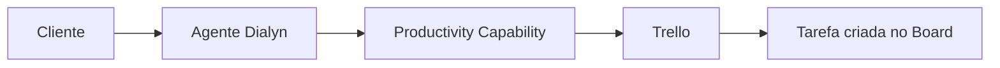
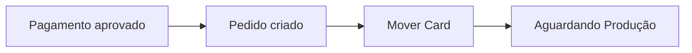
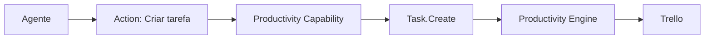

# Trello

> Integração de produtividade utilizada pela Dialyn para permitir que agentes de IA gerenciem tarefas, quadros e fluxos de trabalho através do Trello.

---

## Objetivo

O Trello é utilizado pela Dialyn para permitir que agentes inteligentes acompanhem e automatizem atividades operacionais dentro de equipes — criando, atualizando e monitorando tarefas sem que os usuários precisem acessar o Trello manualmente.

> O agente se torna um participante ativo da gestão de tarefas, conectando conversas diretamente ao fluxo de trabalho da empresa.

---

## Resumo

| Característica | Descrição |
|---------------|-----------|
| 🎯 **Foco** | Gestão visual de tarefas com Kanban |
| 🗂️ **Recursos** | Boards, Cards, Checklists, Tasks |
| 🔁 **Automação** | Criação, movimentação e atualização de Cards |
| 👥 **Público** | Equipes de suporte, dev, marketing, vendas |
| 🤖 **Integração** | Productivity Capability da Dialyn |

---

## Problemas que resolve

### Atualização manual de tarefas

| Sem Dialyn | Com Dialyn |
|------------|-----------|
| Cliente solicita alteração | Cliente conversa com agente |
| Funcionário acessa Trello | Agente identifica necessidade |
| Procura o Card manualmente | Productivity Capability processa |
| Atualiza manualmente | Card atualizado automaticamente |

> O agente identifica a necessidade e executa a atualização sem intervenção humana.

### Acompanhamento de atividades

O agente consulta tarefas em andamento para responder perguntas como:

- *"Qual o status do projeto?"*
- *"Essa atividade já foi concluída?"*
- *"Quem é o responsável?"*
- *"Existem tarefas pendentes?"*

---

## Casos de uso

### Criar tarefas

Durante uma conversa, o agente cria novas tarefas automaticamente — suporte, melhoria, demanda interna ou acompanhamento de clientes.

---

### Atualizar Cards

O agente pode alterar descrições, mover Cards entre listas, adicionar comentários, trocar responsáveis e modificar datas.

---

### Consultar tarefas

Cliente: *"Meu chamado já está sendo tratado?"*

O agente consulta o Card correspondente antes de responder.

---

### Automatizar fluxos

Eventos externos disparam movimentações automáticas:

---

### Registrar atividades

Durante conversas, o agente registra observações, histórico, comentários e atualizações diretamente em um Card.

---

## Público recomendado

| Perfil | Exemplos |
|--------|----------|
| 🛠️ **Suporte** | Chamados e solicitações |
| 💻 **Desenvolvimento** | Demandas técnicas e bugs |
| 📢 **Marketing** | Campanhas e entregas |
| 💰 **Vendas** | Leads e propostas |
| 📋 **Operações** | Processos internos |

---

## Capacidades utilizadas

| Capability | Resources |
|-----------|-----------|
| **Productivity** | `Board` · `Card` · `Task` |

---

## Actions disponibilizadas

| Categoria | Ações |
|-----------|-------|
| Boards | Consultar, listar |
| Cards | Criar, consultar, atualizar, mover, arquivar |
| Tasks | Criar, atualizar, concluir, consultar |

---

## Princípios

| # | Princípio | Descrição |
|---|-----------|-----------|
| 1 | 🔗 **Independência** | Agentes não dependem do Trello — ele é um Provider |
| 2 | 🔄 **Automação** | Tarefas criadas e movidas sem intervenção manual |
| 3 | 🧩 **Visibilidade** | Status e responsáveis sempre disponíveis na conversa |
| 4 | 📖 **Rastreabilidade** | Histórico de alterações preservado nos Cards |

---

## Benefícios

| # | Benefício |
|---|-----------|
| 1 | ⚡ **Agilidade** na criação e atualização de tarefas |
| 2 | 🤖 **Redução** de trabalho operacional da equipe |
| 3 | 🔗 **Conexão** entre atendimento e operação |
| 4 | 📊 **Visibilidade** em tempo real do progresso |
| 5 | 🔁 **Automação** de fluxos entre eventos e Cards |

---

## Quando não usar

Embora excelente para gestão visual, outros Providers da Capability **Productivity** podem ser mais adequados para:

- documentação corporativa
- base de conhecimento
- wikis internas
- gestão de calendários e agendas

---

## Papel na arquitetura

O Trello não define as capacidades da plataforma — ele **implementa** a Capability **Productivity**.

> Operações como criar Cards, mover tarefas ou consultar Boards seguem o mesmo fluxo, mantendo os agentes desacoplados do Provider.

---

## Veja também

| Documento | Objetivo |
|-----------|----------|
| [README.md](./README.md) | Visão geral da integração |
| [Notion](../notion/provider.md) | Provider de documentação |
| [Google Calendar](../google-calendar/provider.md) | Provider de calendário |
