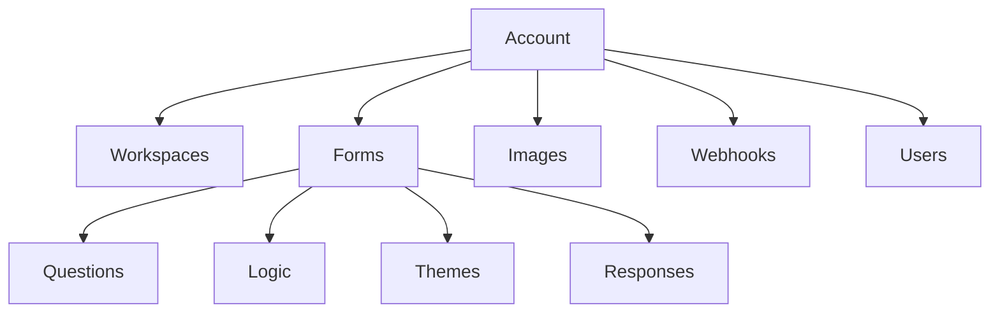
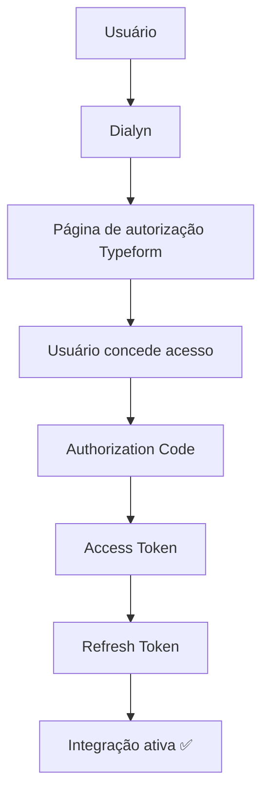
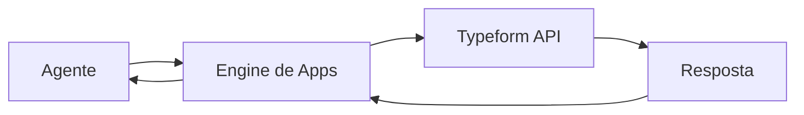

# Typeform API

> Referências oficiais utilizadas para a integração do **Typeform** na Dialyn.

---

## Objetivo

Este documento reúne os principais conceitos necessários para compreender como a Dialyn irá integrar-se ao **Typeform**.

> **Nota:** Neste momento, o objetivo não é implementar funcionalidades, mas entender como a autenticação, permissões e arquitetura da API funcionam.

🔗 [Portal de Desenvolvedores Typeform](https://www.typeform.com/developers/)

---

## O que é o Typeform?

O **Typeform** é uma plataforma para criação de formulários, pesquisas, quizzes e processos de coleta de dados.

Através da API é possível integrar aplicações externas para consultar formulários, criar formulários (quando suportado), coletar respostas e automatizar fluxos de trabalho.

| Operação | Descrição |
|----------|-----------|
| 🔍 Consultar formulários | Listar formulários da conta |
| 📊 Consultar respostas | Obter dados das respostas coletadas |
| 🔔 Criar webhooks | Notificações em tempo real |
| 👥 Consultar usuários | Dados dos membros da conta |
| 🔎 Pesquisar formulários | Buscar formulários específicos |
| ⚡ Acompanhar respostas | Monitoramento em tempo real |

---

## Arquitetura do Typeform

A estrutura do Typeform é organizada em recursos pertencentes a uma **conta**.

> Antes de implementar qualquer integração é recomendado compreender essa organização.

🔗 [Comece por aqui](https://www.typeform.com/developers/create/)

---

## Primeiro passo

Antes de qualquer integração o usuário deverá possuir:

| Requisito | Descrição |
|-----------|-----------|
| ✅ Conta Typeform | Possuir uma conta ativa |
| 📋 Pelo menos um formulário | Formulário criado na conta |
| 🔧 Permissão para criar tokens | Gerar Personal Access Token ou autorizar OAuth |

> Toda integração inicia pela **autenticação da conta**.

---

## Métodos de Autenticação

O Typeform suporta **dois modelos** principais.

### 🔑 Personal Access Token

O usuário gera um token diretamente em sua conta.

| Característica | Detalhe |
|----------------|---------|
| Indicado para | Integrações privadas |
| Complexidade | Simples — token único |

🔗 [Personal Access Token](https://www.typeform.com/developers/get-started/personal-access-token/)

### 🌐 OAuth 2.0

Utilizado quando uma aplicação precisa conectar contas Typeform de **diferentes usuários**.

| Etapa | Descrição |
|-------|-----------|
| 1 | Usuário inicia fluxo pela **Dialyn** |
| 2 | Dialyn redireciona para **autorização Typeform** |
| 3 | Usuário **concede acesso** |
| 4 | Typeform gera um **Authorization Code** |
| 5 | Código é trocado por um **Access Token** |
| 6 | **Refresh Token** é gerado (quando aplicável) |
| 7 | Integração é **ativada** |

🔗 [OAuth Typeform](https://www.typeform.com/developers/oauth/)

---

## Credenciais

Dependendo do método utilizado, poderão ser necessárias:

### Personal Access Token

| Credencial | Descrição |
|------------|-----------|
| `Personal Access Token` | Token gerado na conta do usuário |

### OAuth 2.0

| Credencial | Descrição |
|------------|-----------|
| `Client ID` | Identificador público da aplicação |
| `Client Secret` | Chave privada da aplicação |
| `Access Token` | Token de acesso temporário |
| `Refresh Token` | Token para renovação de acesso |

---

## Permissões (Scopes)

O Typeform utiliza **Scopes** para controlar o acesso aos recursos.

| Scope | Descrição |
|-------|-----------|
| `forms:read` | Consultar formulários |
| `forms:write` | Criar e editar formulários |
| `responses:read` | Consultar respostas |
| `images:write` | Gerenciar imagens |
| `accounts:read` | Consultar dados da conta |
| `webhooks:read` | Consultar webhooks |
| `webhooks:write` | Criar e editar webhooks |

> A Dialyn deverá solicitar **apenas os Scopes necessários**.

🔗 [OAuth Scopes](https://www.typeform.com/developers/oauth/)

---

## Dados que a Dialyn deve armazenar

| Campo | Tipo | Descrição |
|-------|------|-----------|
| `Provider` | `string` | Identificador do provedor |
| `Workspace ID` | `string` | ID do workspace (quando disponível) |
| `Client ID` | `string` | Identificador (OAuth) |
| `Client Secret` | `string` | Chave privada (OAuth) |
| `Personal Access Token` | `string` | Token de acesso direto |
| `Access Token` | `string` | Token de acesso (OAuth) |
| `Refresh Token` | `string` | Token para renovação (OAuth) |
| `Scopes` | `array` | Permissões concedidas |
| `Status` | `enum` | Status da integração |
| `Created At` | `datetime` | Data de criação |
| `Updated At` | `datetime` | Data de atualização |

---

## Recursos principais

| Recurso | Descrição |
|---------|-----------|
| 📋 Forms | Formulários e pesquisas |
| 📊 Responses | Respostas coletadas |
| ❓ Questions | Perguntas do formulário |
| 🧩 Logic | Fluxos condicionais |
| 🎨 Themes | Aparência visual |
| 🖼️ Images | Imagens da conta |
| 📁 Workspaces | Agrupamento de formulários |
| 👥 Users | Usuários da conta |
| 🔔 Webhooks | Eventos em tempo real |

🔗 [Referência da API](https://www.typeform.com/developers/create/reference/)

---

## Conceitos importantes

### Workspace

Agrupa **formulários** pertencentes à conta.

### Form

Representa um **formulário** com suas perguntas e configurações.

### Question

Cada **pergunta** existente dentro de um formulário.

### Response

Representa uma **resposta** enviada por um participante.

### Logic

Permite criar **fluxos condicionais** dentro dos formulários (ex.: mostrar pergunta X se resposta Y).

### Theme

Define a **aparência visual** do formulário (cores, fontes, layout).

### Webhook

**Evento** enviado automaticamente quando um formulário recebe uma nova resposta ou ocorre outro evento suportado.

---

## Fluxo Geral

> O agente **nunca** comunica-se diretamente com o Typeform. Toda comunicação deverá ocorrer através do **Engine de Apps** da Dialyn.

---

## Regras de Negócio

| # | Regra |
|---|-------|
| 1 | ❌ **Nunca** expor `Client Secret` |
| 2 | ❌ **Nunca** expor `Personal Access Token` |
| 3 | ❌ **Nunca** expor `Access Token` |
| 4 | 🔐 Utilizar **HTTPS** em todas as chamadas |
| 5 | 🎯 Solicitar apenas os **Scopes** necessários |
| 6 | 🔄 Renovar automaticamente o `Access Token` quando utilizar OAuth |
| 7 | 🚫 Permitir ao usuário **revogar a integração** a qualquer momento |
| 8 | ✅ Validar periodicamente se a autorização permanece ativa |

---

## API Reference

🔗 [Documentação completa da API](https://www.typeform.com/developers/create/reference/)

---

## Webhooks

O Typeform oferece **Webhooks** para comunicação em tempo real. Eles permitem que a Dialyn seja notificada quando um formulário receber novas respostas, **eliminando a necessidade de consultas constantes**.

🔗 [Webhooks Typeform](https://www.typeform.com/developers/webhooks/)

---

## Limites da API

A API do Typeform possui limites de utilização (**Rate Limits**).

| Requisito | Descrição |
|-----------|-----------|
| ⏱️ Rate Limit | Limite de requisições por período |
| 🔄 Retry | Implementar mecanismos de repetição |

> A Dialyn deverá monitorar esses limites e implementar mecanismos de repetição quando necessário.

🔗 [Rate Limits](https://www.typeform.com/developers/get-started/rate-limits/)

---

## Boas práticas

| # | Prática |
|---|---------|
| 1 | 🌐 Utilizar **OAuth 2.0** para integrações públicas |
| 2 | 🔑 Utilizar **Personal Access Token** para integrações privadas |
| 3 | ❌ **Nunca** expor credenciais |
| 4 | 🎯 Solicitar apenas os **Scopes** necessários |
| 5 | 🔔 Utilizar **Webhooks** sempre que possível |
| 6 | ⏱️ Tratar **limites de utilização** da API |
| 7 | 🏗️ Centralizar toda comunicação através do **Engine de Apps** da Dialyn |

---

## Próximo Documento

Após compreender esta documentação, iniciar:

📄 [`/docs/apps/architeture/dtos/crm/README.md`](/docs/apps/architeture/dtos/crm/README.md)

---

### Conteúdo previsto

| Ação | Descrição |
|------|-----------|
| 📋 Listar Formulários | Todos os formulários da conta |
| 🔍 Consultar Formulário | Detalhes de um formulário |
| ❓ Consultar Perguntas | Perguntas do formulário |
| 📊 Consultar Respostas | Respostas coletadas |
| ➕ Criar Formulário | Novo formulário (quando suportado) |
| ✏️ Atualizar Formulário | Editar formulário existente |
| 🔎 Buscar Respostas | Filtrar respostas específicas |
| 🔔 Criar Webhooks | Registrar webhook |
| 🗑️ Remover Webhooks | Excluir webhook |
| ⚡ Receber Eventos | Notificações em tempo real |
| 👥 Consultar Usuários | Dados dos membros |
