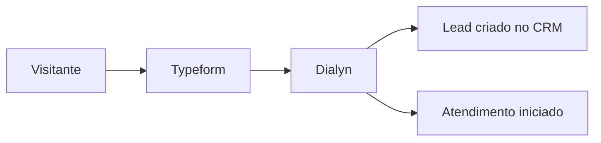
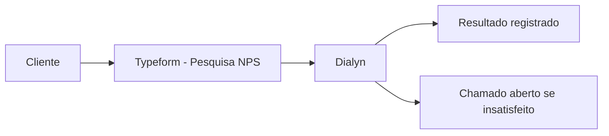
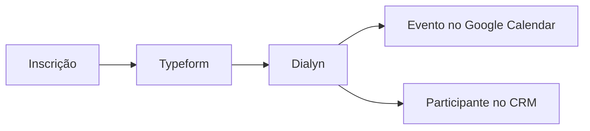
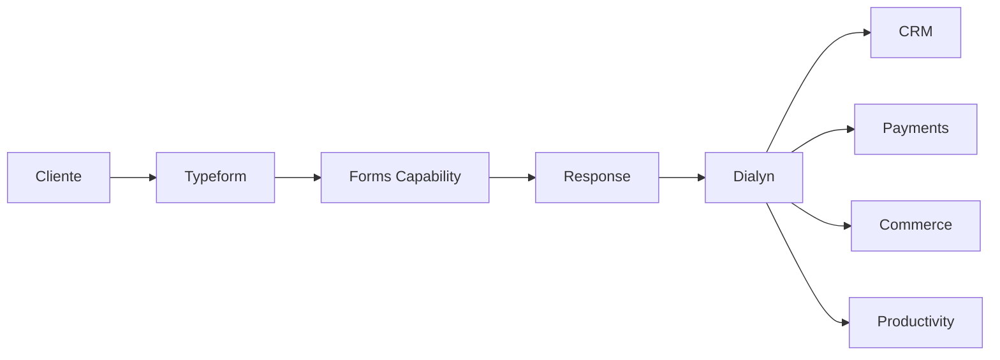

# Typeform

> Integração utilizada pela Dialyn para permitir que agentes de IA criem, compartilhem e processem formulários inteligentes, transformando respostas em ações automatizadas.

---

## Objetivo

O Typeform é utilizado pela Dialyn para coletar informações de forma estruturada através de formulários interativos.

Enquanto uma conversa obtém informações de maneira dinâmica, um formulário garante que todos os dados necessários sejam preenchidos de forma organizada e validada.

> As respostas viram ações automáticas dentro da empresa — sem digitação manual nem transferência entre sistemas.

---

## Resumo

| Característica | Descrição |
|---------------|-----------|
| 🎯 **Foco** | Coleta estruturada de informações |
| 📋 **Recursos** | Formulários, respostas, lógica condicional |
| 🔁 **Automação** | Ações disparadas após o envio |
| 👥 **Público** | Empresas que precisam capturar dados |
| 🤖 **Integração** | Forms Capability da Dialyn |

---

## Problemas que resolve

### Coleta manual de informações

| Sem Dialyn | Com Dialyn |
|------------|-----------|
| Equipe envia formulário | Cliente preenche Typeform |
| Respostas analisadas manualmente | Dialyn processa automaticamente |
| Dados copiados para outros sistemas | Fluxo automatizado disparado |
| Retrabalho e erros de digitação | Zero intervenção manual |

### Integração entre formulários e processos

Após o envio, o agente pode:

| Ação | Destino |
|------|---------|
| Criar Lead | CRM |
| Agendar reunião | Google Calendar |
| Iniciar onboarding | Productivity |
| Gerar cobrança | Payments |
| Abrir tarefa | Trello / Notion |

> Tudo sem intervenção manual.

---

## Casos de uso

### Captura de Leads

Visitante preenche um formulário → agente cria o Lead e classifica o potencial cliente.

---

### Solicitação de orçamento

O formulário coleta produto, quantidade, prazo e orçamento. Após o envio, o agente inicia o processo comercial.

---

### Pesquisa de satisfação

Após o atendimento, o cliente responde um questionário. O agente registra o resultado, identifica insatisfeitos e abre chamados automaticamente.

---

### Onboarding

Novos clientes preenchem dados da empresa, contatos e preferências. As informações alimentam automaticamente os demais sistemas.

---

### Inscrição em eventos

O formulário coleta nome, e-mail, empresa e cargo. Após o envio, o agente cria eventos no Google Calendar ou registra participantes no CRM.

---

## Público recomendado

| Perfil | Exemplos |
|--------|----------|
| 📢 **Marketing** | Captura de Leads, pesquisas NPS |
| 💼 **Vendas** | Solicitação de orçamento, qualificação |
| 🛠️ **Suporte** | Pesquisa de satisfação, chamados |
| 👥 **RH** | Inscrições, onboarding, feedbacks |
| 📊 **Produto** | Pesquisas de experiência do usuário |

---

## Capacidades utilizadas

| Capability | Resources |
|-----------|-----------|
| **Forms** | `Form` · `Response` |

---

## Actions disponibilizadas

| Categoria | Ações |
|-----------|-------|
| Formulários | Criar, consultar, atualizar, listar |
| Respostas | Consultar, listar, processar |

---

## Princípios

| # | Princípio | Descrição |
|---|-----------|-----------|
| 1 | 🔗 **Independência** | Agentes não dependem do Typeform — ele é um Provider |
| 2 | 🧩 **Estrutura** | Dados coletados de forma organizada e validada |
| 3 | 🔄 **Automação** | Respostas viram ações sem intervenção humana |
| 4 | 🔗 **Integração** | Formulários conectados a todas as Capabilities |

---

## Benefícios

| # | Benefício |
|---|-----------|
| 1 | ⚡ **Agilidade** na coleta e processamento de dados |
| 2 | 🤖 **Eliminação** de digitação e transferência manual |
| 3 | 🎯 **Dados estruturados** e prontos para uso |
| 4 | 🔁 **Fluxos automatizados** a partir de qualquer resposta |
| 5 | 🔗 **Conexão** direta com CRM, Payments, Commerce e Productivity |

---

## Quando não usar

O Typeform não substitui um CRM, um sistema de pagamentos ou uma plataforma de e-commerce.

Seu papel é **capturar informações** que posteriormente serão utilizadas por outras Capabilities.

> Para armazenamento ou processamento, utilize os Providers específicos de cada Capability.

---

## Papel na arquitetura

O Typeform implementa a Capability **Forms**, permitindo que agentes utilizem formulários através de um contrato universal.

> As respostas podem alimentar qualquer Capability da plataforma, tornando o Typeform um ponto de entrada de dados para os fluxos automatizados da Dialyn.

---

## Veja também

| Documento | Objetivo |
|-----------|----------|
| [README.md](./README.md) | Visão geral da integração |
| [Salesforce](../sales-force/provider.md) | Provider de CRM |
| [Trello](../trello/provider.md) | Provider de tarefas |
