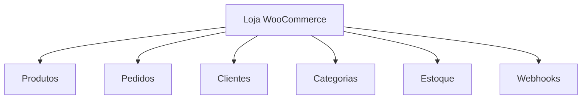
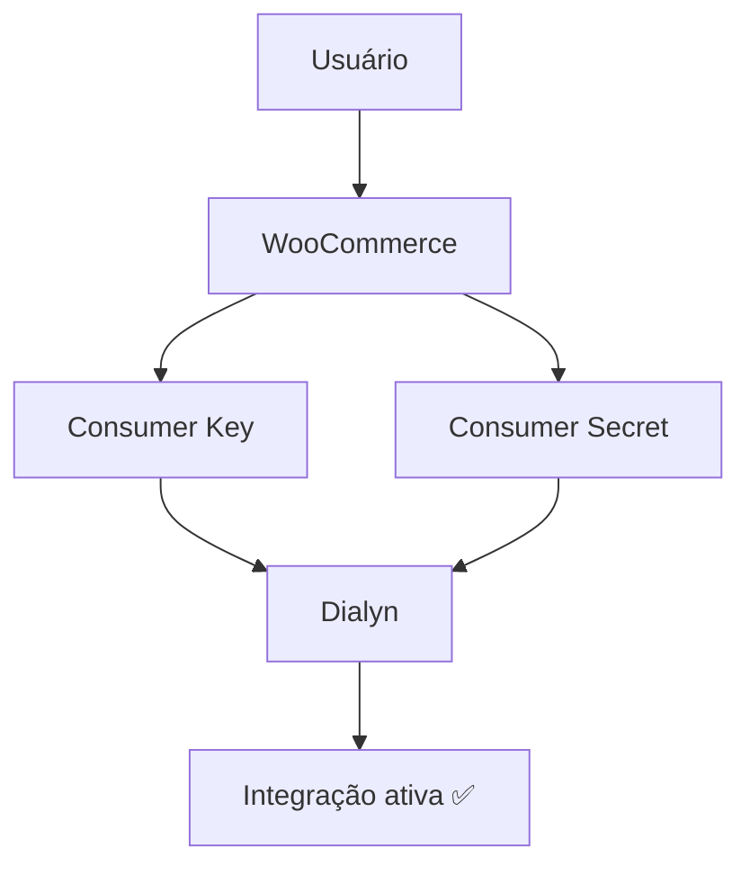
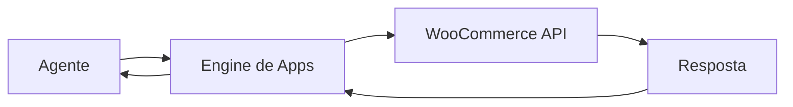

# WooCommerce API

> Referências oficiais utilizadas para a integração do WooCommerce na Dialyn.

---

## Objetivo

Este documento reúne os principais conceitos necessários para compreender como a Dialyn irá integrar-se ao **WooCommerce**.

> **Nota:** Neste momento, o objetivo não é implementar funcionalidades, mas entender como a autenticação, permissões e arquitetura da API funcionam.

🔗 https://woocommerce.github.io/woocommerce-rest-api-docs/

---

## O que é o WooCommerce?

O **WooCommerce** é uma plataforma de e-commerce baseada no WordPress que permite vender produtos físicos e digitais através de uma loja própria.

Através da API REST é possível integrar aplicações externas para automatizar operações relacionadas ao catálogo, pedidos, clientes, estoque e demais recursos da loja.

| Operação | Descrição |
|----------|-----------|
| 📦 Consultar produtos | Obter catálogo de produtos |
| 🛒 Consultar pedidos | Acompanhar pedidos realizados |
| 👥 Consultar clientes | Buscar informações dos compradores |
| 📂 Consultar categorias | Listar categorias cadastradas |
| 📦 Consultar estoque | Verificar disponibilidade de produtos |
| 🏷️ Consultar atributos | Informações sobre variações |
| 🚚 Consultar métodos de envio | Configurações de entrega |
| 🔔 Receber Webhooks | Notificações em tempo real |

---

## Arquitetura do WooCommerce

A estrutura do WooCommerce é organizada em torno da loja virtual.

> Antes de implementar qualquer integração é recomendado compreender essa organização.

---

## Primeiro passo

Antes de qualquer integração o usuário deverá possuir:

| Requisito | Descrição |
|-----------|-----------|
| ✅ Site WordPress | Instância ativa |
| 🛒 WooCommerce instalado | Plugin configurado |
| 🔧 API REST habilitada | Recursos disponíveis |
| 🔑 Chaves da API | Consumer Key e Consumer Secret |

> Toda integração inicia pela geração das credenciais da API.

🔗 https://woocommerce.github.io/woocommerce-rest-api-docs/

---

## O que é uma Aplicação?

Uma aplicação representa um sistema autorizado a consumir a API REST do WooCommerce.

No contexto da Dialyn, a aplicação representa a própria plataforma.

---

## Credenciais

Após gerar as credenciais da API, o WooCommerce disponibiliza:

| Credencial | Descrição |
|------------|-----------|
| `Consumer Key` | Identificador público da aplicação |
| `Consumer Secret` | Chave privada utilizada para autenticação |

Essas credenciais identificam a Dialyn perante a loja.

---

## Método de Autenticação

O WooCommerce utiliza autenticação baseada em **Consumer Key** e **Consumer Secret**.

| Etapa | Descrição |
|-------|-----------|
| 1 | Usuário gera credenciais na loja |
| 2 | Informa as credenciais para a Dialyn |
| 3 | A Dialyn valida a conexão |
| 4 | Integração é ativada |

---

## Consumer Key

| Propriedade | Descrição |
|-------------|-----------|
| Uso | Identifica a aplicação |
| Segurança | Pode ser revogada a qualquer momento |

---

## Consumer Secret

| Propriedade | Descrição |
|-------------|-----------|
| Uso | Autenticação das requisições |
| Segurança | Deve ser armazenada de forma segura |

---

## Permissões

Ao gerar as credenciais é possível definir permissões.

| Permissão | Descrição |
|-----------|-----------|
| Read | Apenas leitura |
| Write | Escrita |
| Read/Write | Leitura e escrita |

> A Dialyn deverá solicitar apenas as permissões necessárias.

---

## Dados que a Dialyn deve armazenar

| Campo | Tipo | Descrição |
|-------|------|-----------|
| `Provider` | `string` | Identificador do provedor |
| `Store URL` | `string` | URL da loja |
| `Consumer Key` | `string` | Chave pública |
| `Consumer Secret` | `string` | Chave privada |
| `Permissions` | `enum` | Permissões concedidas |
| `Status` | `enum` | Status da integração |
| `Created At` | `datetime` | Data de criação |
| `Updated At` | `datetime` | Última atualização |

---

## Recursos principais

| Recurso | Descrição |
|---------|-----------|
| 📦 Produtos | Catálogo da loja |
| 🛒 Pedidos | Compras realizadas |
| 👥 Clientes | Compradores cadastrados |
| 📂 Categorias | Organização do catálogo |
| 📦 Estoque | Quantidade disponível |
| 🏷️ Atributos | Variações dos produtos |
| 🚚 Métodos de envio | Configuração logística |
| 🔔 Webhooks | Eventos em tempo real |

---

## Fluxo Geral

> O agente **nunca** comunica-se diretamente com o WooCommerce. Toda comunicação deverá ocorrer através do **Engine de Apps** da Dialyn.

---

## Regras de Negócio

| # | Regra |
|---|-------|
| 1 | ❌ Nunca expor o Consumer Secret |
| 2 | 🔐 Utilizar HTTPS |
| 3 | 🔒 Armazenar credenciais de forma segura |
| 4 | 🎯 Solicitar apenas as permissões necessárias |
| 5 | 🔄 Validar periodicamente a conexão |
| 6 | 🚫 Permitir revogar a integração |
| 7 | 🔔 Utilizar Webhooks quando disponíveis |

---

## Conceitos importantes

### Produto

Representa um item comercializado na loja.

Pode ser:

- simples;
- variável;
- agrupado;
- digital;
- virtual.

---

### Pedido

Representa uma compra realizada por um cliente.

Status comuns:

| Status | Descrição |
|--------|-----------|
| Pending | Aguardando pagamento |
| Processing | Em processamento |
| Completed | Pedido concluído |
| Cancelled | Cancelado |
| Refunded | Reembolsado |
| Failed | Falha no pagamento |

---

### Cliente

Representa um comprador cadastrado na loja.

---

### Categoria

Utilizada para organizar os produtos.

---

### Estoque

Quantidade disponível para venda.

---

### Webhooks

Eventos enviados automaticamente pelo WooCommerce.

Exemplos:

| Evento | Descrição |
|--------|-----------|
| Produto criado | Novo produto cadastrado |
| Produto atualizado | Alteração no catálogo |
| Pedido criado | Nova venda |
| Pedido atualizado | Alteração de status |
| Cliente criado | Novo cliente |

---

## API Reference

🔗 https://woocommerce.github.io/woocommerce-rest-api-docs/

---

## Limites da API

Os limites dependem da infraestrutura onde o WooCommerce está hospedado.

A Dialyn deverá:

| Requisito | Descrição |
|-----------|-----------|
| Retry | Repetir requisições quando apropriado |
| Timeout | Configurar tempos de resposta |
| Tratamento | Lidar adequadamente com indisponibilidades |

---

## Boas práticas

| # | Prática |
|---|---------|
| 1 | Utilizar HTTPS |
| 2 | Nunca expor o Consumer Secret |
| 3 | Armazenar credenciais de forma segura |
| 4 | Solicitar apenas permissões necessárias |
| 5 | Utilizar Webhooks sempre que possível |
| 6 | Centralizar toda comunicação através do Engine de Apps |

---

## Próximo Documento

Após compreender esta documentação, iniciar:

📄 [`/docs/apps/architeture/dtos/commerce/README.md`](/docs/apps/architeture/dtos/commerce/README.md)

---

### Conteúdo previsto

| Ação | Descrição |
|------|-----------|
| 📦 Consultar Produtos | Catálogo completo |
| 🛒 Consultar Pedidos | Pedidos realizados |
| 👥 Consultar Clientes | Informações dos compradores |
| 📂 Consultar Categorias | Organização do catálogo |
| 📦 Consultar Estoque | Disponibilidade dos produtos |
| 🏷️ Consultar Atributos | Variações dos produtos |
| 🚚 Consultar Métodos de Envio | Configurações logísticas |
| 🔔 Receber Webhooks | Eventos em tempo real |
| 📈 Consultar Status dos Pedidos | Acompanhamento de vendas |
| 🔄 Atualizar Produtos | Sincronização do catálogo |