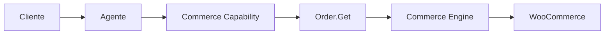
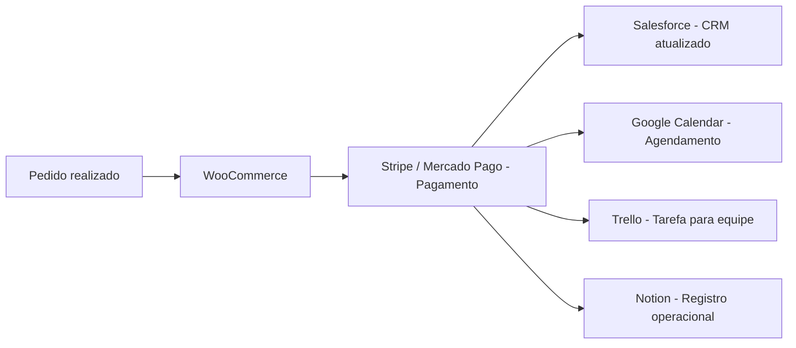

# WooCommerce

> Integração de e-commerce utilizada pela Dialyn para permitir que agentes de IA gerenciem lojas virtuais baseadas em WordPress, automatizando vendas, pedidos, clientes e operações comerciais.

---

## Objetivo

O WooCommerce é utilizado pela Dialyn para conectar agentes inteligentes a lojas virtuais desenvolvidas com WordPress.

Enquanto o Shopify oferece uma plataforma hospedada, o WooCommerce permite que empresas tenham **controle total** sobre sua loja, infraestrutura e personalizações.

> O agente se torna um assistente comercial capaz de consultar produtos, acompanhar pedidos, verificar estoques e automatizar tarefas — operando a loja de forma inteligente.

---

## Resumo

| Característica | Descrição |
|---------------|-----------|
| 🎯 **Foco** | E-commerce autogerenciado com WordPress |
| 🛒 **Recursos** | Produtos, pedidos, clientes, estoque |
| 🔁 **Automação** | Atendimento, pós-venda, operação |
| 👥 **Público** | Lojas com infraestrutura própria |
| 🤖 **Integração** | Commerce Capability da Dialyn |

---

## O que é o WooCommerce?

O WooCommerce é uma plataforma de e-commerce de **código aberto** construída sobre o WordPress.

| Suporta | Exemplos |
|---------|----------|
| 📦 **Produtos físicos** | Roupas, eletrônicos, alimentos |
| 💾 **Produtos digitais** | E-books, software, cursos |
| 🔁 **Assinaturas** | Planos recorrentes |
| 🏪 **Marketplaces** | Múltiplos vendedores |
| 🎓 **Cursos** | Plataforma de ensino |
| 🔌 **Extensões** | Milhares de plugins da comunidade |

> Na prática, ele transforma um site WordPress em uma plataforma completa de comércio eletrônico.

---

## Problemas que resolve

### Atendimento comercial manual

| Sem Dialyn | Com Dialyn |
|------------|-----------|
| Cliente pergunta sobre produto | Cliente conversa com agente |
| Funcionário acessa WooCommerce | Agente consulta Commerce Capability |
| Procura o produto manualmente | WooCommerce retorna os dados |
| Consulta estoque separadamente | Resposta imediata ao cliente |

> O agente consulta todas as informações em tempo real — estoque, preço, disponibilidade.

### Acompanhamento de pedidos

O agente responde automaticamente:

- *"Meu pedido foi enviado?"*
- *"O pagamento foi aprovado?"*
- *"Qual o status da entrega?"*
- *"Tenho compras anteriores?"*

---

## Casos de uso

### Consulta de produtos

O agente pesquisa produtos por nome, categoria, SKU, atributos, preço e disponibilidade.

---

### Consulta de estoque

Cliente: *"Vocês ainda possuem esse modelo?"*

O agente verifica a disponibilidade antes de recomendar.

---

### Acompanhamento de pedidos

O agente informa situação, forma de pagamento, data da compra, código de rastreamento e previsão de entrega.

---

### Consulta de clientes

O agente acessa histórico de pedidos, produtos adquiridos, endereço e dados cadastrais — permitindo atendimento personalizado.

---

### Automação comercial

| Evento | Ação automática |
|--------|----------------|
| Novo pedido | Criar tarefa no Trello |
| Pagamento aprovado | Gerar nota fiscal |
| Pedido enviado | Avisar o cliente |
| Cliente cadastrado | Criar Lead no CRM |
| Compra concluída | Iniciar fluxo de pós-venda |

---

## Público recomendado

| Perfil | Exemplos |
|--------|----------|
| 🏪 **Lojas virtuais** | E-commerce com WordPress |
| 🏗️ **Infraestrutura própria** | Empresas com servidor dedicado |
| 🎨 **E-commerces personalizados** | Plugins e temas customizados |
| 🏢 **Agências digitais** | Clientes com lojas WooCommerce |
| 🛍️ **Marketplaces** | Múltiplos vendedores |

---

## Capacidades utilizadas

| Capability | Resources |
|-----------|-----------|
| **Commerce** | `Product` · `Order` · `Customer` · `Inventory` · `Category` |

---

## Actions disponibilizadas

| Categoria | Ações |
|-----------|-------|
| Produtos | Consultar, pesquisar, atualizar |
| Pedidos | Consultar, atualizar, listar |
| Clientes | Consultar, atualizar |
| Estoque | Consultar, atualizar |
| Categorias | Consultar, listar |

---

## Princípios

| # | Princípio | Descrição |
|---|-----------|-----------|
| 1 | 🔗 **Independência** | Agentes não dependem do WooCommerce — ele é um Provider |
| 2 | 🧩 **Controle total** | Loja, infraestrutura e personalização sob gestão da empresa |
| 3 | 🔄 **Automação** | Consultas e atualizações sem acesso ao painel |
| 4 | 🔗 **Integração** | Conectado a CRM, Payments, Productivity |

---

## Benefícios

| # | Benefício |
|---|-----------|
| 1 | ⚡ **Atendimento ágil** com consulta ao catálogo em tempo real |
| 2 | 🤖 **Redução** de trabalho operacional da equipe |
| 3 | 📦 **Acompanhamento** de pedidos sem acesso ao painel |
| 4 | 🧠 **Histórico do cliente** para atendimento personalizado |
| 5 | 🔁 **Automação** de processos comerciais e pós-venda |

---

## Quando não usar

Embora flexível, alguns cenários podem ser mais adequados para outros Providers:

| Cenário | Alternativa |
|---------|------------|
| Plataforma totalmente gerenciada | Shopify |
| Cursos e infoprodutos | Hotmart |
| Apenas pagamentos | Asaas, Stripe ou Mercado Pago |

---

## Papel na arquitetura

O WooCommerce não define as capacidades da plataforma — ele **implementa** a Capability **Commerce**.

> Operações como consultar produtos, verificar estoque ou acompanhar pedidos seguem o mesmo fluxo, mantendo os agentes desacoplados da plataforma.

---

## Integração entre Capabilities

A arquitetura Dialyn permite que a loja trabalhe em conjunto com outras Capabilities.

> O WooCommerce torna-se o centro das operações comerciais da loja, enquanto as demais integrações complementam a jornada do cliente de forma automatizada.

---

## Veja também

| Documento | Objetivo |
|-----------|----------|
| [README.md](./README.md) | Visão geral da integração |
| [Shopify](../shopify/provider.md) | Provider de e-commerce gerenciado |
| [Hotmart](../hotmart/provider.md) | Provider de infoprodutos |
